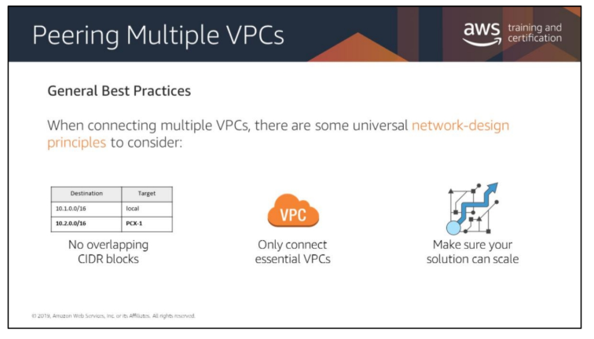
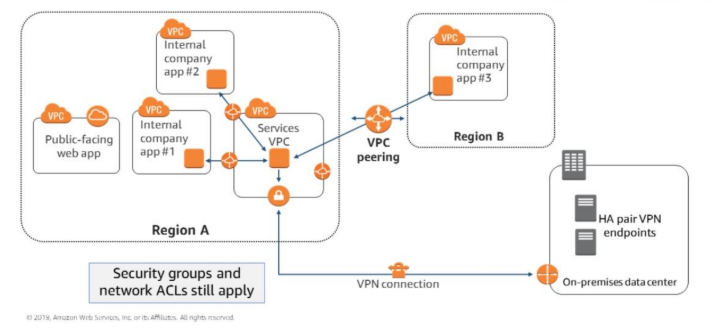

# Intro to Networking Part 2

## Overview
* Connecting Networks
* VPC Endpoints
    * Think the AWS Backbone
* Load Balancing
    * Elastic Load Balancing
    * Application Load Balancing
* High Availability 
    * Think Multi-AZ Deployments (Regional Deploymenys)

## Virtual Private Gateway (VGW)
* Enables you to establish private connections (VPNs) 
* VPN Tunnels
* Direct Connects

## Extending On-Premises Network with VGW
* Two endpoints into AWS (Active-Standby)
* VPN Connection connects the VGW to the Customer Gateway (aka the On-Prem endpoint)
* __Each tunnel 1.25GB of Bandwidth__

## VPNs and AWS
* __VGW__ -- AWS is connecting to you through an ISP (via your company's VPN) to use VGW
* __Direct Connect (DX)__ -- In a NSP, AWS installs their own routers, modems, and their own fiber to establish a Direct Connect.
    * Opens a dedicated private network connection of either __1 or 10 Gbps__
    * Only allows a single endpoint (aka a Single-Fiber-Point or SFP)
* __Cloud Hub__ -- a service for customers using multple VPNs to connect to VGW

## Extending On-Premises Network to AWS using DX
* Dedicated network connection over private lines
* __IF IT IS A 1GB LINK__ --> 1 Virtual Interface (VIF) 
* __IF IT IS A 10GB LINK__ --> multiple VIFs and on-premise VLANs
* Notes on VIFs
    * Public VIFs: For the internet
    * Private VIFs: For services (like S3 and DynamoDB) 

## Connecting VPCs
* Isolatng some of your workloads is generally a good practice
    * To do this you would do __VPC Peering__
        * A Peering Resource or (Peering Resource Extension) is an identifier installed in your VPCs' routing tables
        * Use private IP addresses in the routing tables
        * Think of this as a man-in-the-middle with VPC Peering resource in the middle
            * Transitive peering relationships are not supported
            * Can be established between __accounts__
            * Can be established between __regions__
        * This is a private connection
        * Traffic stays in the AWS Backbone
    * __Transit Gateway__: Can connect up to __5,000 VPCs__ and On-Premises environments with a single gateway
        * Comes with 2 ENIs per VPC connection
        * Transit Gateways are scoped to the __REGION__

### Best Practice Design
* Peering Multiple VPCs
  
* Partial Mesh Design
    * Shared services VPC that everyone is connecting to.

## VPC Endpoints
* Privately connect your ec2 instances to services outside your VPC __without leaving AWS__
* Don't need to use an internet gateway, VPN, network address translation (NAT) devices, or firewall proxies.
* Scoped to the __REGION__
* Horizontally scaled, redundant, and highly available.
    * Two types of endpoints
        * Interface endpoints
            * Elastic network interface with a private IP address that serves as an entry point for traffic destined to a supported service.
        * Gateway endpoints
            * Gateway that is a target for a specified route in your route table, used for traffic destined to a supported AWS service

